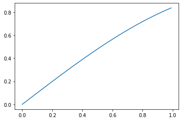

```python
%matplotlib inline
```


```python
import matplotlib.pyplot as plt
import numpy
```

## Introduction

Here is some text


```python
x = numpy.r_[0:1:.01]
y = numpy.sin(x)
plt.plot(x,y)
```


    [<matplotlib.lines.Line2D at 0x7f2e88ba9ad0>]


    

    

